# Libreasy - A library management app

Libreasy is an app made with **Flutter** framework and **Oracle** backend along with **ORDS** for API.
 

It provides book borrowing and library information services to members. It is also used to assist the librarian in maintaining the book catalogue and in book-keeping of fines.
 

The backend and frontend code is attached and structured in their respective folders. Further instructions are also found inside those folders.

## Features

  - Author listings and profile.
  - All book listings by genres.
  - Author and book reviews and ratings.
  - Availability of books for borrow.
  - Borrowing books if available.
  - Summary of book/member borrows.
  - Member accounts and profile.
  - Notification is the time period of issue is about to expire.
  - And much more.

<kbd></kbd>

  

&nbsp;&nbsp;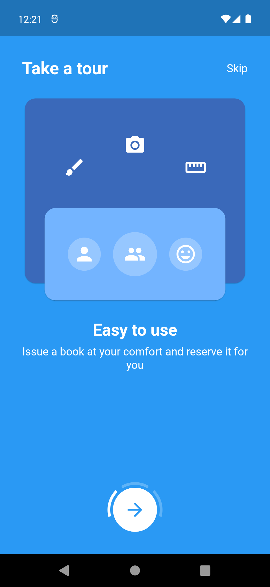&nbsp;&nbsp;  
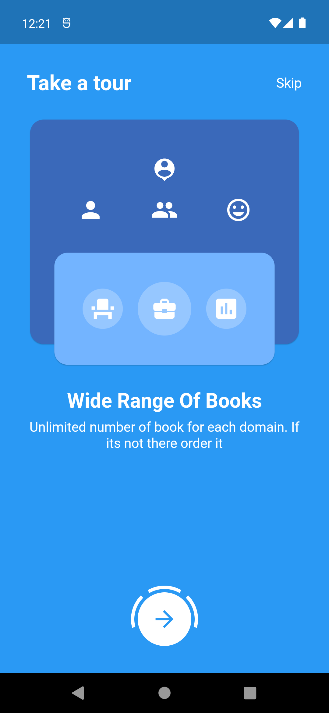&nbsp;&nbsp;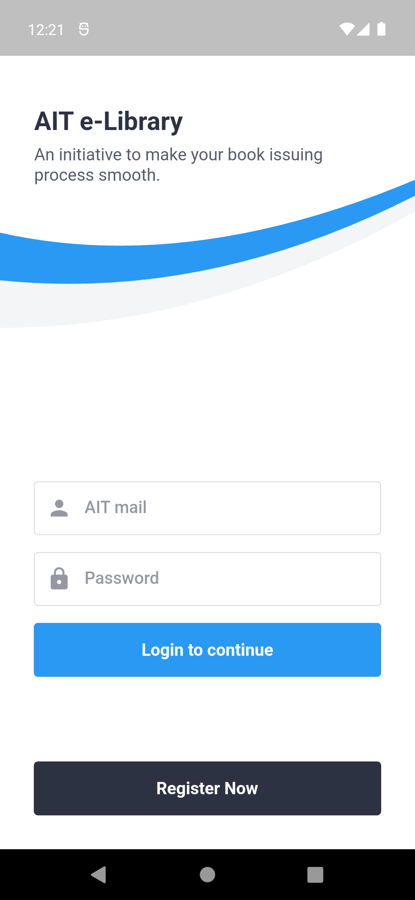&nbsp;&nbsp;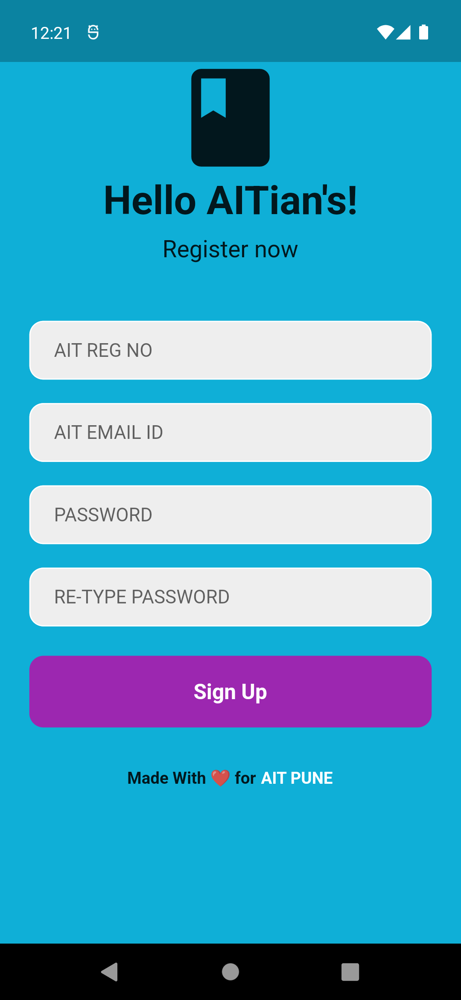  
&nbsp;&nbsp;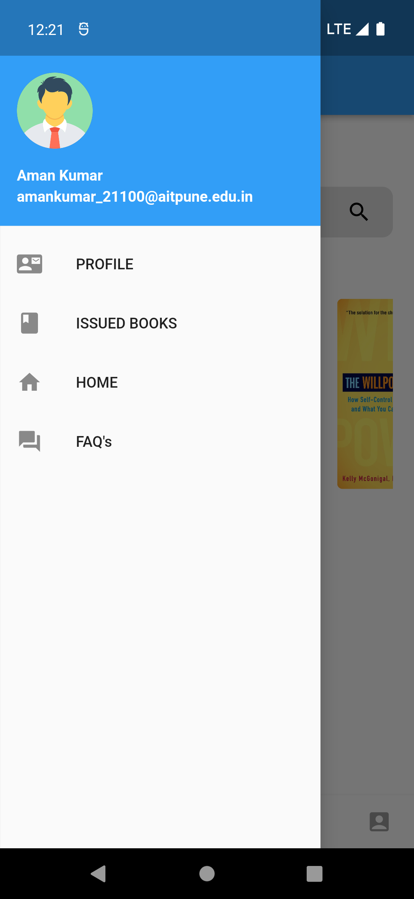&nbsp;&nbsp;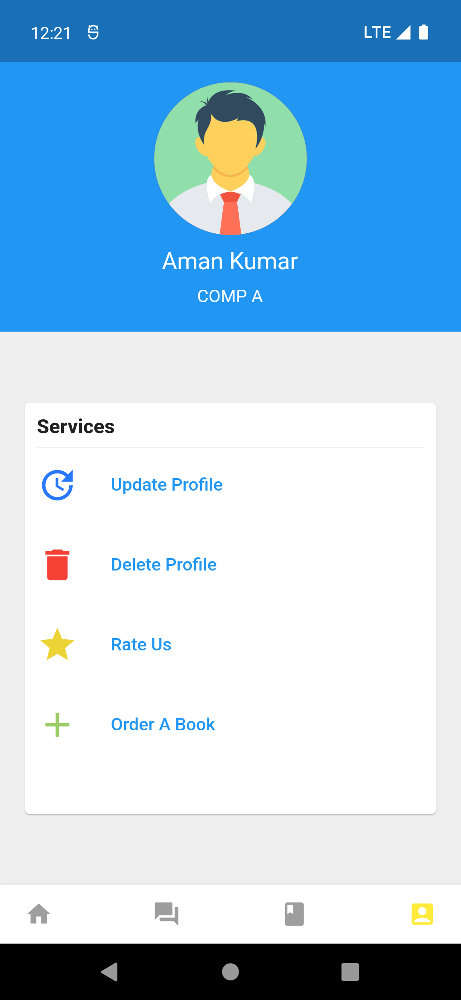  
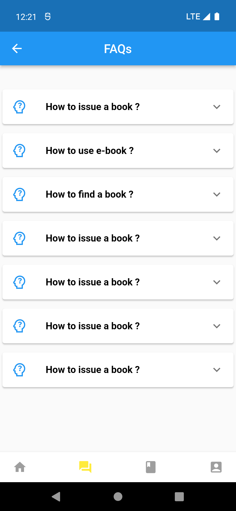&nbsp;&nbsp;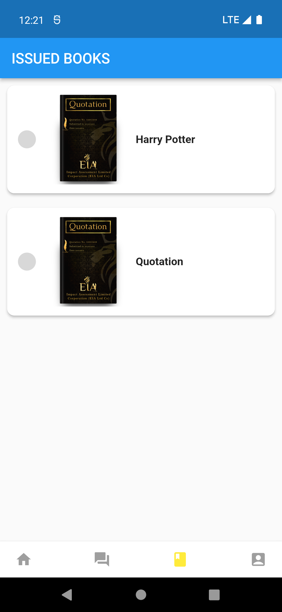&nbsp;&nbsp;  
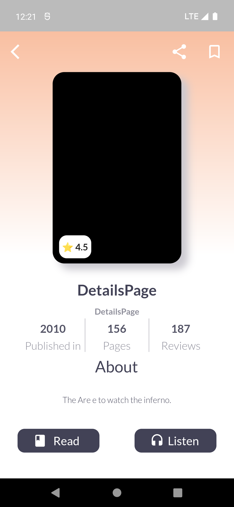&nbsp;&nbsp;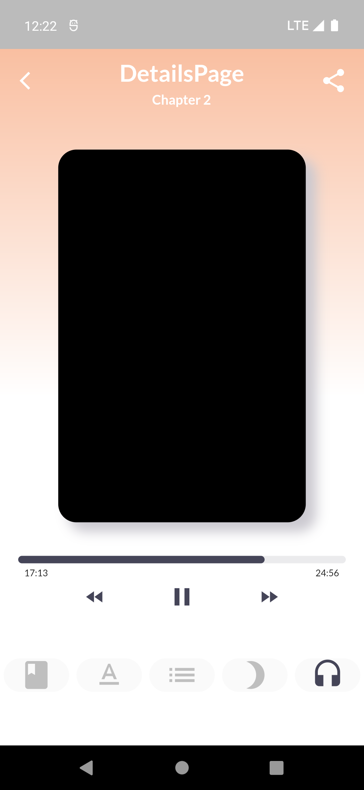&nbsp;&nbsp;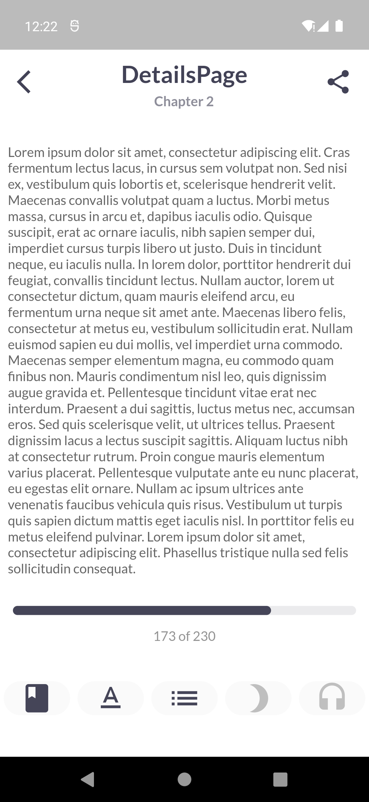  

*New features are to be added in future* ❤︎

## 🚀 Technologies

  - [Flutter v3.3.1]()
  - [Dart v2.18.0]()
  - [Firebase]()
  - Tools used
  - [VS Code and Android Studio]()

## 🤝 Contribute

To contribute, fork the repository and push the changes to the **master** branch. Then submit a pull request for merging with the source. If your code passes the review and checks it will be merged into the master branch.

## 💬 Feedback

Feel free to send us feedback on [Twitter](https://twitter.com/gitpointapp) or [file an issue](https://github.com/arafaysaleem/library_management_system/issues/new). Feature requests are always welcome.

## 📝 License

Licensed
